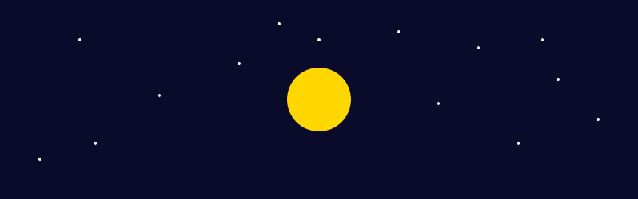

  

# About Me  

Hi, I'm **Nanda Anwar (she/her)**! A **final-year Information Systems student** specializing in **AIoT (Artificial Intelligence of Things), web development, and machine learning**.  

💡 Passionate about **building scalable digital solutions**, exploring **AI for real-world applications**, and integrating **IoT with cloud-based AI**. My work blends **software engineering, data science, and embedded systems** to create impactful projects.  

🔍 I enjoy **researching AI applications**, contributing to **open-source projects**, and sharing **tech insights** to make learning easier for others.  

🌱 Currently working on a **Exploring AIoT** and refining my skills in **Tech-field**.  

🚀 Open to **collaborations**, **tech discussions**, and **new opportunities** in web development, AI, and IoT.  

---

## 🚀 My Focus Areas  
- **Web Development** – Building scalable and modern websites  
- **AI & IoT** – Exploring the intersection of artificial intelligence and connected devices  
- **Tech Education** – Creating content to simplify complex concepts  

---

## 🔧 Tech Stack  

### 🌐 Web Development  

### 🤖 AI & Machine Learning  

### 📡 IoT & Embedded Systems  

### 🛠️ Tools & DevOps  

---

## 🤝 Open to Collaboration

I'm open to collaborating on interesting **tech projects, AI & IoT innovations, and educational content**.  
If you have an idea, feel free to reach out!

---

## 📊 GitHub Stats

---

## 📬 Connect with Me

💡 _"To the moon! 🚀🌕"_

---

## 📊 Visitor Analytics

